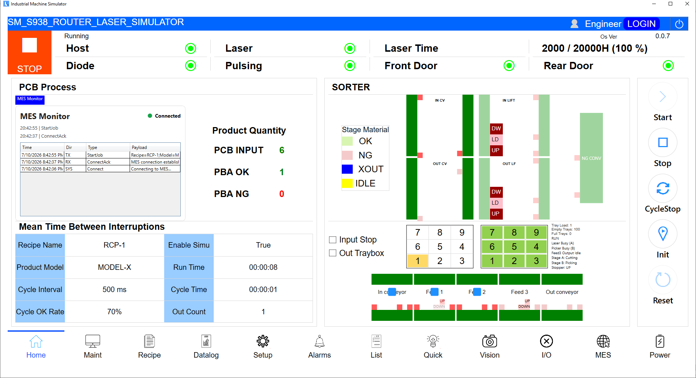
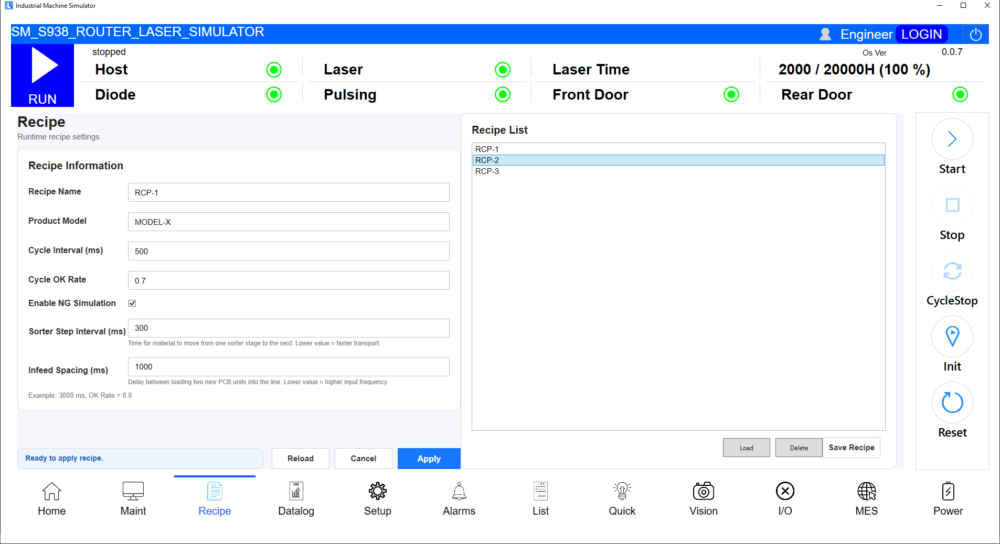
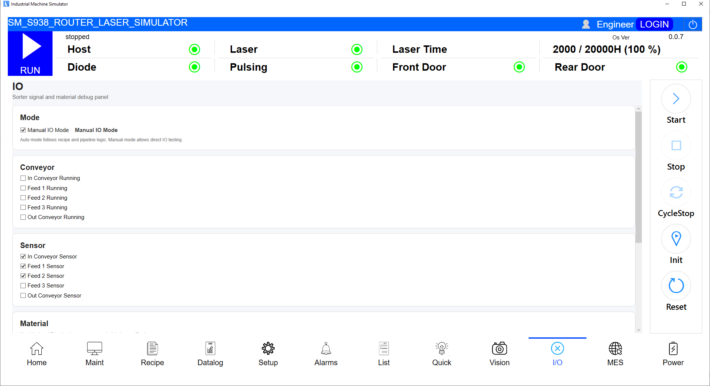
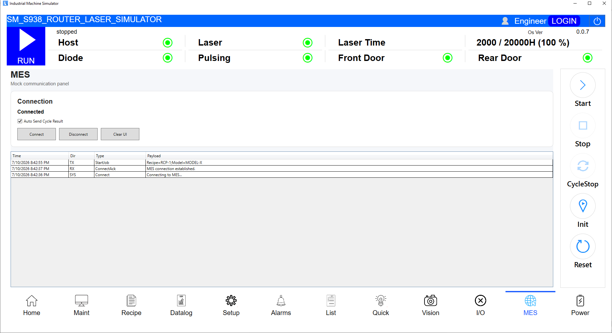
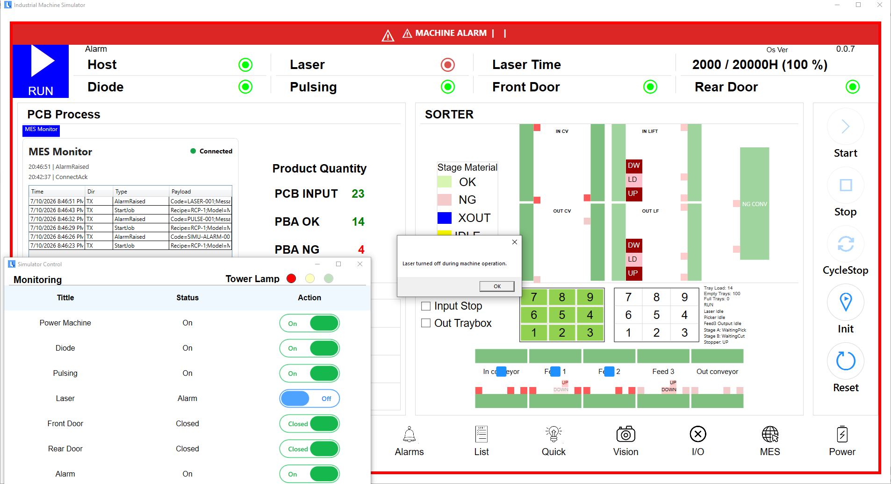

# Industrial Machine Simulator

A WPF/.NET desktop application that simulates an industrial router laser machine UI, including machine state flow, sorter/conveyor simulation, recipe management, alarm handling, operation logging, and MES mock communication.

This project was built as a portfolio project for Industrial Software / Machine Control Software / Automation Software roles.

---

## Overview

Industrial Machine Simulator is a desktop HMI-style application that models the basic behavior of an industrial laser routing machine.

The application focuses on realistic machine UI logic, including:

- Machine state flow
- Initialization sequence
- Start / Stop / Cycle Stop / Reset commands
- Conveyor and sorter simulation
- Laser cutting stage simulation
- Safety interlock and alarm behavior
- Recipe and configuration management
- Operation and alarm logging
- MES-style mock communication

---

## Tech Stack

- C#
- .NET 8
- WPF
- MVVM-style architecture
- SQLite
- JSON configuration
- Async / Await
- CancellationToken
- Repository pattern
- Mock MES communication

---

## Key Features

### Machine State Flow

The application simulates a full machine lifecycle:

Offline → Standby → Initializing → Ready → Running → Stopped / Alarm

Supported commands:

- Power On / Off
- Initialize
- Start
- Stop
- Cycle Stop
- Reset
- Exit

---

### Initialization Sequence

The machine includes a simulated initialization process with:

- Progress percentage
- Initialization overlay
- Cancel button
- Safety checks during initialization
- Alarm trigger if power, door, laser, diode, or pulsing signal becomes invalid

---

### Sorter / Conveyor Simulation

The sorter engine simulates material movement through multiple machine areas:

Input Conveyor → Feed 1 → Feed 2 → Laser Stage A/B → Feed 3 → Output Conveyor

It includes:

- Material position tracking
- Feed sensors
- Conveyor running states
- Feed 1 stopper behavior
- Laser stage A/B processing
- Picker unload simulation
- Output scheduler
- OK / NG result handling

---

### Stop / Cycle Stop / Emergency Alarm Stop

The project separates normal stop behavior from alarm behavior:

- **Stop**: soft stop behavior
- **Cycle Stop**: stops after current material flow is completed
- **Alarm / Fault**: immediate emergency stop

When an alarm occurs, the machine stops immediately and keeps the current material positions for a more realistic machine fault state.

---

### Safety Interlock and Alarm Handling

The simulator supports alarm triggers for:

- Front door open
- Rear door open
- Laser off
- Diode off
- Pulsing signal off
- Power off during operation
- Manual alarm trigger

Alarm state includes:

- Red machine tower indicator
- Alarm banner
- Red UI border
- Alarm log record
- MES alarm message

---

### Recipe Management

The recipe page allows the operator or engineer to manage machine parameters such as:

- Recipe name
- Product model
- Cycle interval
- OK rate
- Sorter step interval
- Infeed spacing
- NG simulation enable/disable

Recipe and configuration values are persisted through JSON configuration.

---

### Logging

The application includes:

- Operation log
- Alarm log
- Timestamped records
- SQLite persistence
- File logging support

Example events:

- Power on/off
- Initialization started/completed/canceled
- Recipe applied
- Machine started
- Stop requested
- Cycle completed
- Alarm raised
- Reset executed

---

### MES Mock Communication

The MES page simulates basic host communication messages, including:

- Connect
- ConnectAck
- StartJob
- RecipeLoaded
- CycleResult
- AlarmRaised
- Disconnect

This helps demonstrate how a machine UI can interact with a factory-level system.

---

## Screenshots

### Home - Running State

### Recipe Management

### IO Simulation

### MES Monitor

### Alarm State

---

## Demo Video

A short demo video is available in the GitHub Releases section:

[Watch/download demo video](https://github.com/ThangNT9x/industrial-machine-ui-simulator/releases/tag/v1.0.0-demo)

---

## Demo Flow

A typical demo flow:

1. Login as Engineer or Developer
2. Open the Power page and turn on Power Machine
3. Run Initialization
4. Apply recipe
5. Start machine
6. Material moves through sorter/conveyor
7. Laser stage simulation runs
8. OK / NG count increases
9. MES messages are generated
10. Stop or Cycle Stop
11. Trigger alarm
12. Reset machine
13. Run again

---

## Demo Login Credentials

The application starts in the Operator role by default.

To access the Power page and turn on the machine power, please login as Engineer or Developer:

| Role | Password |
|---|---|
| Engineer | `e123` |
| Developer | `d123` |

After login:

1. Open the Power page
2. Turn on Power Machine
3. Run Initialization
4. Start the machine simulation

Without Engineer or Developer login, the Power page and machine power controls are not available.

---

## Portable Build

A Windows portable build is available in the GitHub Releases section:

[Download demo build v1.0.0](https://github.com/ThangNT9x/industrial-machine-ui-simulator/releases/tag/v1.0.0-demo)

To run the portable version:

1. Download `IndustrialMachineSimulator_Win64_Portable.zip`
2. Extract the zip file
3. Run `IndustrialMachineSimulator.UI.exe`
4. Login as Engineer with password `e123` or Developer with password `d123`
5. Open the Power page and turn on Power Machine
6. Run Initialization and start the machine simulation

---

## Project Structure

industrial-machine-ui-simulator  
├── IndustrialMachineSimulator  
│   ├── src  
│   │   ├── IndustrialMachineSimulator.Core  
│   │   ├── IndustrialMachineSimulator.Infrastructure  
│   │   └── IndustrialMachineSimulator.UI  
│   └── IndustrialMachineSimulator.sln  
├── docs  
│   └── screenshots  
├── README.md  
└── .gitignore

---

## What This Project Demonstrates

This project demonstrates my ability to build industrial desktop software with:

- WPF UI development
- MVVM-style separation
- Machine state management
- Safety interlock logic
- Alarm and recovery flow
- Async machine simulation
- Conveyor/sorter process modeling
- Recipe/configuration persistence
- SQLite logging
- MES-style communication
- Portable Windows release packaging

---

## Target Roles

This project is relevant to:

- Junior Industrial Software Engineer
- Machine Control Software Engineer
- Automation Software Engineer
- C#/.NET Desktop Developer
- HMI / SCADA Software Developer
- Factory Software / MES Integration Developer
